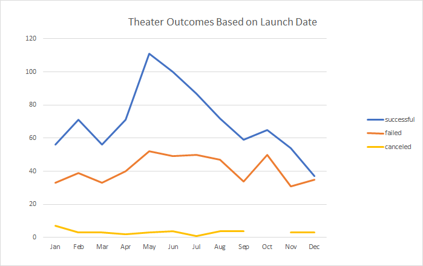

# Kickstarting with Excel

## Overview of Project

Louise is an aspiring playwright, who's play Fever came close to its fundraising goal. Now, she wants to know how different campaigns performed in the category of theater, specifically their results based on their launch dates and their funding goal.  We have an Excel file that encompasses multiple fields of data from past Kickstarter campaigns, and specifically for this project we utilized the data to analyze how Kickstarter campaigns performed in comparison to when they were launched and their fundraising performance dependant on what their target goal was set to.  Included in this project is both a visualization and an analysis of outcomes based on launch date for theater category plays and outcomes based on fundraising goal. 

### Purpose

The purpose of this project was to help Louise understand how other past Kickstarter fundraiser outcomes performed compared against their launch date, specifically for theater plays, in addition to their outcomes based on funding goal.

## Analysis and Challenges

### Analysis of Outcomes Based on Launch Date

Upon reviewing the line graph visual of theater outcomes based on launch date, we can conclude that May is the month with the best performance for successfully launched campaigns, while the months of September through March tend to be the least successful.  Interestingly enough, May also has the highest amount of failed campaigns as well, but it's possible this could also be attributed to the fact that the most campaigns of any month were launched in May.  If you consider the metric of failed campaigns as a ratio to total campaigns launched, December would actually be the highest, with 46.7% of total launched campaigns failing that month.  

### Analysis of Outcomes Based on Goals

Upon reviewing the line chart visual for outcomes based on goal, we can see that Kickstarter campaigns that had a goal of either "Less than $1000" or "$1000 to $4999" had the highest successful percentage performance, coming in at 76% and 73% success rate respectively.  On the flip side, campaigns with a goal of either "$45000 to $49999" or "Greater than $50000" were the least successful, however the sample size is quite lower compared to plays in other goal tiers, with only 13 total projects that had goals set at or to exceed $45000, with only 2 of those successfully meeting their funding goal.  

### Challenges and Difficulties Encountered

There were quite a few data timestamps that were represented as UNIX timestamps which were not easily readable.  To diminish this issue, these UNIX timestamps were covered over to a standard date format so that the dataset was much more easier to read.  There was also quite a bit of rows and columns that were irrelevant for this exercise and created quite a bit of unnecessary scrolling, so to help alleviate this issue, various panes in the larger Kickstarter worksheet tab were frozen in place to ensure the data was locked in place and always visible while scrolling.  The "Parent Category Statistics" and "Subcategory Statistics" tabs from Louise's earlier exercises were also hidden to ensure the total workbook for this project was cleaned up and easiser to navigate.

## Results

We can deduce the following conclusions from Analysis of Outcomes based on Launch Date: 
-	May is the month with the highest count of successfully launched campaigns and percentage of plays launched that were successful.
-	December may not have the highest count of total failed campaigns, but it does represent the month with the highest percentage of failed campaigns when comparing against the total amount of campaigns launched that month.

We can deduce the following conclusions from Analysis of Outcomes based on Goals:
-	Launching plays with low fundraising goals, specifically for less than $5000, will yield the highest successful fundraising percentage. 
-	Plays with fundraising goals of $45000 or greater had the lowest percentage of successful fundraising goals met, however this shouldn't necessarily deduce that higher fundraising goals ALWAYS lead to the lowest successful campaigns funded, as those that had goals between $35000 - $44999 had a higher successful percentage funded compared to those with goals between $5000 - $34999.

There are some limitations of this data set, specifically when looking at the sample size differences in both the month breakout for theater outcomes by launch date as well as the established goal funding tiers when looking at outcomes based on goals.  There is an inconsistent amount of plays launched every month and/or across different funding goal tiers, with some coming in much larger or smaller than others, which may skew our data.

To better help correlate the data for both outcomes by launch date and goals, we can also incorporate measures of central tendency to our dataset, such as the mean, median and mode.  Introducing measures of spread may also be helpful, to understand the standard deviation and if any major outliers exist outside of the allowable quartile range.  To help visualize our spread distributions, we can also build in a box plot graph.
